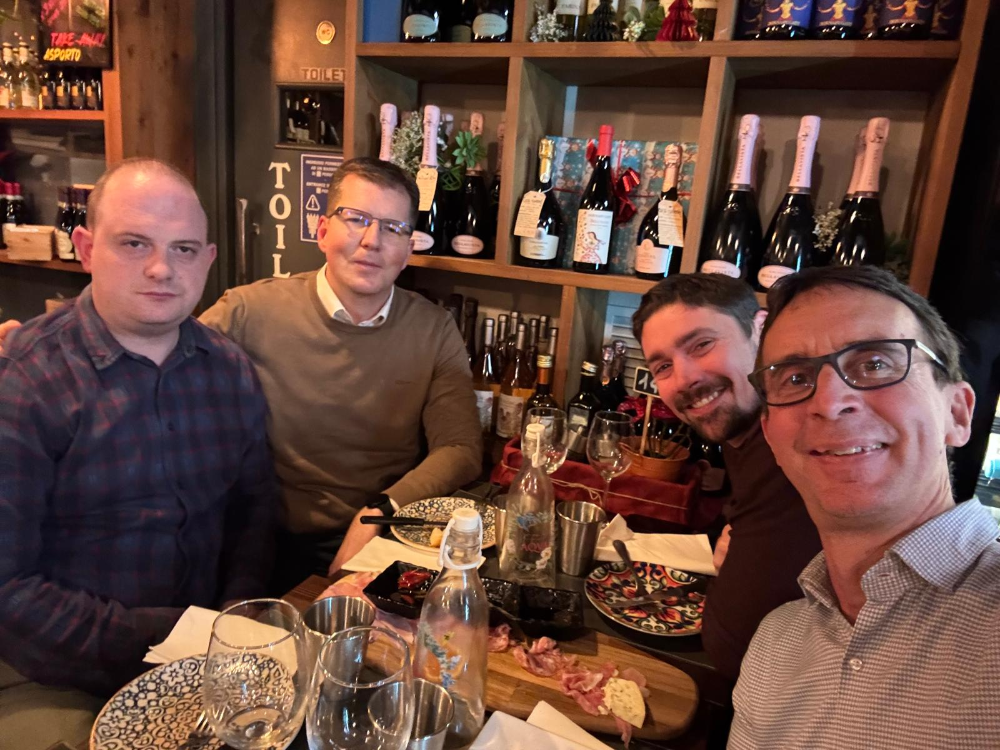
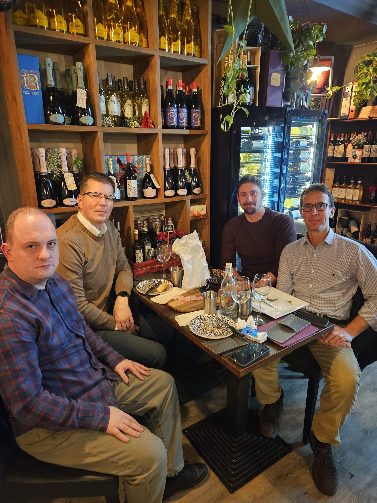

Title: University of Kragujevac Team Visits Verona for "DCM Modeling" Project Collaboration
Date: 2025-12-31
Category: news
Slug: another-news
Cover: /images/spine_cover1.png
Status: published

#### University of Kragujevac Team Visits Verona for "DCM Modeling" Project Collaboration

Members of the University of Kragujevac visited the University Hospital in Verona, Italy, from December 28th to December 30th, 2025. 

The primary objective of the exchange was to harmonize clinical procedures and discuss the integration of machine learning (ML) and the finite element method (FEM) into active clinical practice. These computational frameworks are fundamental to the project's goal of developing patient-specific simulations capable of predicting surgical outcomes and optimizing individualized treatment strategies.

    
    

On Monday, December 29th, the hosts Prof. Dr. Francesco Sala and Dr. Alessandro Boaro, provided an extensive demonstration of their navigated transcranial magnetic stimulation (nTMS) device. This was accompanied by a detailed presentation of their patient evaluation protocols for surgically treated degenerative compressive cervical myelopathy. By aligning clinical, neurophysiological, radiological, and computational workflows, the partnership ensures the methodological consistency required for the success of the DCM Modeling project.
